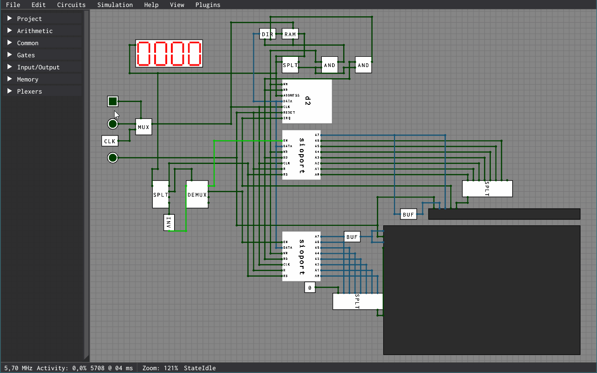

# ⚡ logix


Simulator for logic gates and circuits.

Below is an example gif of a microprocessor, designed by me, that implements a simple instruction set (similar to a 6502), that is running a simple program that prints `Hello World!` to its connected display, and then allows for _infinite_ input by the user via their keyboard. The sample program is written in an assembly-style language (for easy programming of the D2), and the program can be seen [here](/examples/d2/hw-keyboard.s). There is also a [LogiX plugin](/examples/d2/d2-plugin/) for the D2 that allows you to directly assemble a file into the D2's RAM for easy programming and running.



There are a few example projects in the [`examples`](/examples/) directory, which can be opened up in the editor, or simulated on the command line.

## Getting started

If you just want to get your hands dirty and start placing out logic gates and make circuits, all you'll need is a `dotnet` runtime, and to clone down the repository.

The `.csproj` targets `.NET 7`, so you'll need a runtime with version >= 7.

```
git clone https://github.com/dcronqvist/logix
.utils/setup.ps1
cd logix/src/LogiX
dotnet run
```
