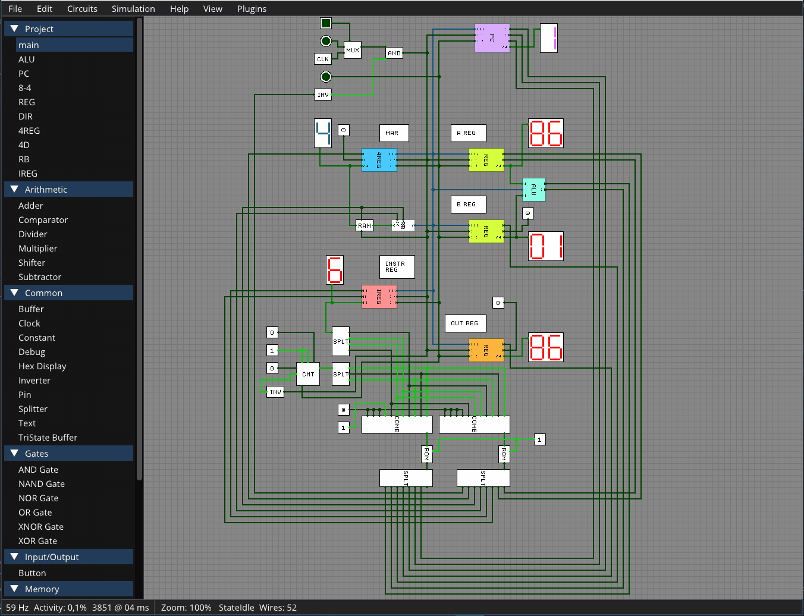

# ⚡ logix


Simulator for logic gates and circuits.

Below is an example gif of the [8-bit computer designed and built by Ben Eater](https://www.youtube.com/watch?v=HyznrdDSSGM&list=PLowKtXNTBypGqImE405J2565dvjafglHU), implemented in LogiX (exists as an [example project](/examples/beneater-8bit/)). In the gif, a very simple program is loaded into memory that is incrementing a counter, until it reaches the value `0xFF`, and then it stops, as well as displaying the result by putting it in the `OUTPUT` register.



There are a few example projects in the [`examples`](/examples/) directory, which can be opened up in the editor, or simulated on the command line.

## Getting started

If you just want to get your hands dirty and start placing out logic gates and make circuits, all you'll need is a `dotnet` runtime, and to clone down the repository.

The `.csproj` targets `.NET 7`, so you'll need a runtime with version >= 7.

```
git clone https://github.com/dcronqvist/logix
.utils/setup.ps1
cd logix/src/LogiX
dotnet run
```
